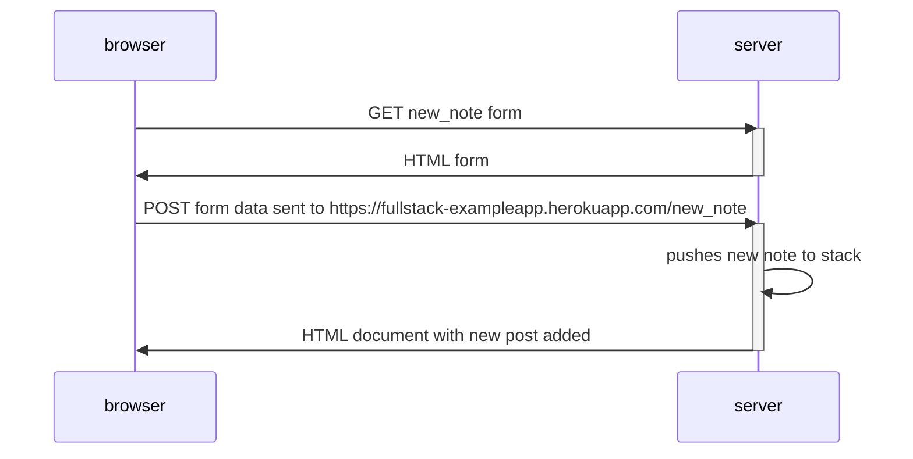
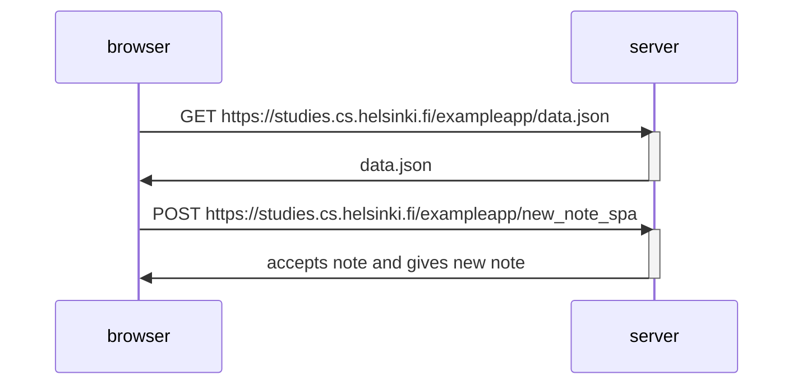

<!-- Part 0.4 -->

```mermaid
sequenceDiagram

participant browser
participant server

browser ->> server: GET new_note form
activate server
server ->> browser: HTML form
deactivate server

browser ->> server: POST form data sent to https://fullstack-exampleapp.herokuapp.com/new_note
activate server
server ->> server: pushes new note to stack
server ->> browser: HTML document with new post added
deactivate server 
```

<!-- Part 0.5 -->

```mermaid
sequenceDiagram

participant browser
participant server

browser ->> server: GET https://studies.cs.helsinki.fi/exampleapp/data.json
activate server
server ->> browser: data.json
deactivate server

browser ->> server: POST https://studies.cs.helsinki.fi/exampleapp/new_note_spa
activate server
server ->> browser: accepts note and gives new note
deactivate server

```